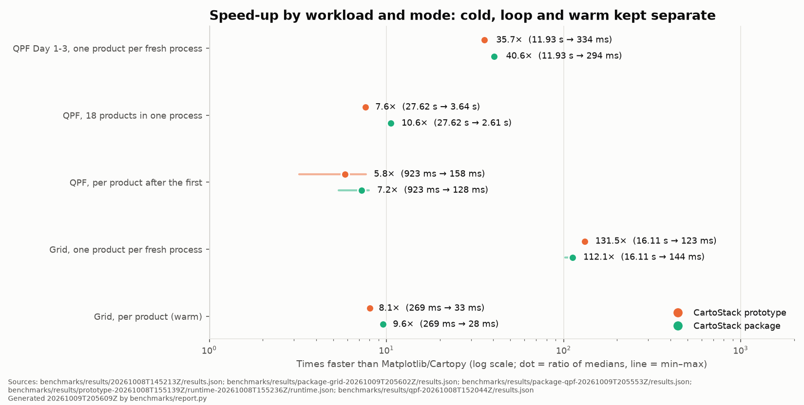

# CartoStack

Fast, repeatable map products from a layered map file.

Operational maps (a precipitation forecast, a temperature analysis) redraw the same
basemap, borders, cities, logo and legend on every run, only to change the data and a
subtitle. CartoStack draws the map **once** with Matplotlib and Cartopy, stores it as a
layered `.cstack` file, and then makes each product by loading that file, swapping in
the new data, stacking the layers and writing a PNG. That runtime needs only **NumPy
and Pillow**: it never imports Matplotlib, Cartopy, pyproj or shapely, and never reads
the original shapefiles or Natural Earth data again.



| Workload (data on disk, Apple M3 Pro, installed wheel) | Matplotlib/Cartopy | CartoStack | Speed-up |
| --- | --- | --- | --- |
| WPC QPF map, one product per fresh process | 11.93 s | 294 ms | 40.6× |
| WPC QPF, all 18 products in one process | 27.62 s | 2.61 s | 10.6× |
| Temperature grid, one product per fresh process | 16.11 s | 144 ms | 112× |
| Temperature grid, per product in a warm process | 269 ms | 28 ms | 9.6× |

One-product times vary by about 10 % from run to run. The QPF output matches the full
Cartopy render to within 8 levels on all but 0.07 % of pixels. `benchmarks/report.py`
regenerates the figure and numbers; the methodology is in [SESSIONS.md](SESSIONS.md).

**Status:** pre-release (`0.0.1.dev0`, format 1.0), validated for a v0.1 release (Session 15) but not yet published. Tested on macOS (arm64) and Linux (arm64 containers), Python 3.12–3.14.

## Install

```bash
pip install cartostack            # runtime only: NumPy and Pillow
pip install "cartostack[build]"   # + authoring: Matplotlib ≥ 3.11.1, Cartopy ≥ 0.26
```

Python ≥ 3.12. Runtime machines need only the first line.

## Quickstart

**1. Author once** (build extra). Draw the map as usual, then tell `SceneBuilder` which
parts become which layers:

```python
import math
from cartostack.build import SceneBuilder

fig, ax = draw_my_map()                      # your existing Matplotlib/Cartopy code

b = SceneBuilder(fig, ax, dpi=150)
b.add_static("below", order=0, background=True, zorder=(-math.inf, 2))
b.add_grid_slot("temperature", order=10, lon=lon, lat=lat, cmap="coolwarm",
                vmin=-5, vmax=30, alpha=0.8, artists=[mesh])
b.add_static("above", order=20, zorder=(2, math.inf), artists=[title])
b.add_colorbar("colorbar", cbar, slot="temperature", order=25)
b.add_text_slot("subtitle", subtitle_artist, order=30)
b.save("grid.cstack")
```

**2. Update on every run** (NumPy and Pillow only):

```python
from cartostack import Scene

with Scene.load("grid.cstack") as scene:
    scene.replace_grid("temperature", values)   # new (ny, nx) array
    scene.text["subtitle"] = "Valid 2026-10-09 18:00 UTC"
    scene.save_png("t2m_18z.png")
```

Complete, runnable versions of both, for a grid map and for the WPC QPF map, are in
[`examples/`](examples/README.md).

## What a `.cstack` file can hold

- **Static layers:** anything Matplotlib draws (basemap, borders, labels, logos,
  legends), stored as RGBA pixels.
- **Grid slots:** new values coloured through a stored pixel→cell map, a linear colour
  range and a colormap. The colour range and colormap can change at runtime.
- **Polygon slots:** new classified polygons in lon/lat (e.g. WPC QPF), projected with
  NumPy (Lambert Conformal Conic) and filled by value bins.
- **Text slots:** one line of text (titles, valid times) laid out the way Matplotlib
  lays it out, using a font embedded in the file.
- **Colorbars:** redrawn with Matplotlib-identical ticks when a grid's colour range or
  colormap changes.

At runtime you can also add, remove, hide, move or re-order layers. Every layer shares
one canvas geometry, so a layer that would be misaligned is refused instead. Files are
verified (SHA-256) on load, written atomically and deterministically, and
contain no pickled objects or code.

See the [API reference](docs/api.md), including its **limitations** section, and the
[format specification](docs/format.md).

## Documentation

| Document | Contents |
| --- | --- |
| [docs/api.md](docs/api.md) | Runtime and authoring API, lifecycle, errors, limitations |
| [docs/format.md](docs/format.md) | The `.cstack` format 1.0 specification |
| [examples/](examples/README.md) | Authoring and cron-style runtime scripts |
| [docs/design.md](docs/design.md) | The original architecture proposal and roadmap |
| [SESSIONS.md](SESSIONS.md) | What has been built and verified, session by session; development commands |
| [CONTRIBUTING.md](CONTRIBUTING.md) | Development setup, checks, environment checks |

## License

MIT
